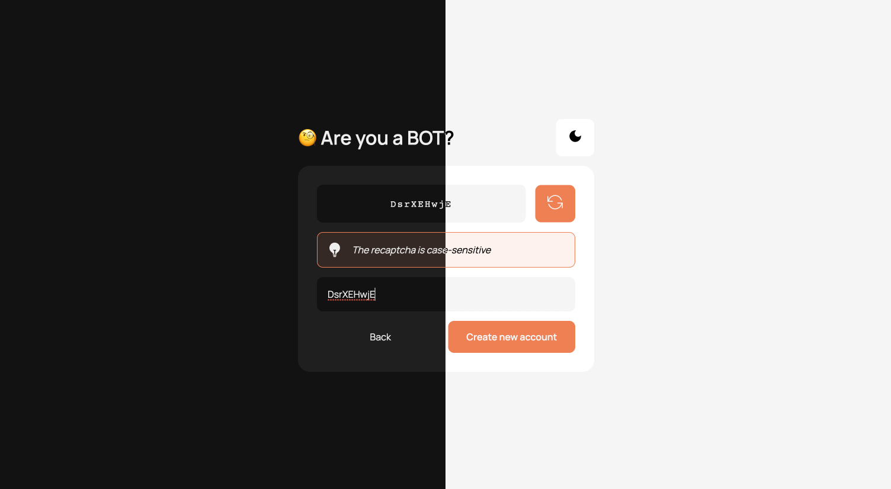

# Client-side ReCAPTCHA Project

## Introduction

Welcome to the React.js ReCAPTCHA project!

ReCAPTCHA is a service provided by Google that helps protect websites from spam and abuse. It uses advanced risk analysis techniques to determine whether a user is a human or a bot. This project demonstrates a client-side implementation of the ReCAPTCHA service built from scratch using the React.js library.

## Features

-   Create user accounts
-   Verify if the user is a BOT or not

## Built With

-   ReactJS
